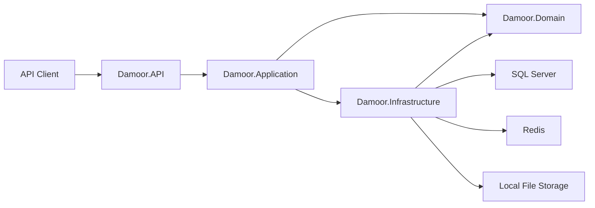

# Damoor

Damoor is a .NET 9 e-commerce backend under active development for an apparel store. The solution contains a normalized catalog, cart, wishlist, review, ordering, guest-session, and identity data model, with an ASP.NET Core Web API and an initial product-listing feature.

## Overview

Damoor is intended to support customers shopping for clothing products such as T-shirts, shorts, and trousers.

The implemented domain and persistence model supports:

- Registered customers through ASP.NET Core Identity.
- Guest shopping sessions identified by a session token.
- Product categories, variants, inventory, pricing, and images.
- Session-based carts and cart items.
- Customer wishlists and reviews.
- Registered and guest orders.
- Historical order-item snapshots for product names, variant descriptions, quantities, and prices.
- Hybrid deletion rules for catalog, transactional, and short-lived data.

The HTTP API is still at an early stage. The currently implemented business endpoint is an authenticated, paginated product query. Authentication endpoints, checkout commands, cart endpoints, wishlist endpoints, review endpoints, and administrative catalog commands are not currently implemented.

## Architecture

The solution uses a **Clean Architecture-inspired layered design** with **CQRS and vertical-slice feature organization** in the Application and API projects.

It is not strict Clean Architecture: `Damoor.Application` currently references `Damoor.Infrastructure`, and the product query handler accesses `DamoorDbContext` and `ICacheService` directly. No repository abstraction is currently implemented.



### Layer responsibilities

| Project | Responsibility |
| --- | --- |
| `Damoor.API` | HTTP controllers, API versioning, Swagger, JWT bearer authentication, middleware, filters, rate-limiter definitions, health endpoint, and application startup |
| `Damoor.Application` | MediatR requests and handlers, FluentValidation rules, pipeline behaviors, DTOs, pagination, and response models |
| `Damoor.Domain` | Domain entities, order status, audit abstractions, soft-delete abstractions, and non-deletable markers |
| `Damoor.Infrastructure` | EF Core, SQL Server, Identity stores, entity configurations, migrations, Redis caching, health checks, auditing/deletion interception, and local file storage |

### Project structure

```text
Damoor/
├── Damoor.API/
│   ├── Controllers/
│   ├── Extensions/
│   ├── Filters/
│   ├── Middleware/
│   └── Program.cs
├── Damoor.Application/
│   ├── Common/
│   │   ├── Behaviours/
│   │   ├── Exceptions/
│   │   └── Models/
│   └── Features/
│       └── Products/
├── Damoor.Domain/
│   ├── Common/
│   └── Entities/
├── Damoor.Infrastructure/
│   ├── Extensions/
│   ├── Identity/
│   ├── Interfaces/
│   ├── Persistence/
│   │   ├── Configurations/
│   │   ├── Interceptors/
│   │   └── Migrations/
│   └── Services/
├── AGENTS.md
└── Damoor.sln
```

### Patterns in use

- CQRS-style requests and handlers with MediatR.
- Vertical slices for API and Application product features.
- FluentValidation through a MediatR pipeline behavior.
- Structured request timing through a MediatR logging behavior.
- EF Core Fluent API with one configuration class per application entity.
- Global query filters for soft-deleted entities and hidden catalog dependents.
- A SaveChanges interceptor for UTC auditing and hybrid deletion behavior.
- Standardized API response and pagination models.
- Distributed caching through an `ICacheService` abstraction backed by Redis.

## Technology Stack

| Category | Technology |
| --- | --- |
| Framework | .NET 9 / ASP.NET Core 9 |
| Language | C# with nullable reference types and implicit usings |
| Database | Microsoft SQL Server |
| ORM | Entity Framework Core 9.0.15 |
| Authentication | ASP.NET Core Identity with integer keys and JWT bearer authentication |
| Authorization | Controller-level `[Authorize]`; roles and policies are not otherwise implemented |
| Application messaging | MediatR 14.1.0 for in-process requests |
| Validation | FluentValidation 12.1.1 |
| Caching | Redis via `IDistributedCache` and StackExchange.Redis |
| Logging | Built-in `ILogger`; Serilog packages and configuration are present but startup activation is currently disabled |
| API documentation | Swashbuckle / Swagger and ASP.NET API Versioning |
| Health monitoring | SQL Server DbContext and Redis health checks |
| File storage | Local filesystem under `wwwroot/uploads` |
| Testing | No test project identified during code analysis |
| Background jobs | Not identified during code analysis |
| Event bus / messaging | Not identified during code analysis |
| External APIs | Not identified during code analysis |
| Docker | Not identified during code analysis |
| Kubernetes | Not identified during code analysis |
| Cloud services | Not identified during code analysis |

## Features

### Currently exposed API functionality

- Versioned API route structure.
- Authenticated product-list endpoint.
- Product search by name or description.
- Product sorting by name, minimum variant price, or creation date.
- Stable pagination using product ID as a tie-breaker.
- Minimum variant price and total variant stock projection.
- Redis caching for product requests without a search term.
- Standard response envelopes with pagination metadata.
- Swagger UI in the Development environment.
- SQL Server and Redis health checks at `/health`.

### Implemented domain and persistence capabilities

- Categories and products.
- Product variants with:
  - Unique SKU.
  - Size and color.
  - Variant-specific price.
  - Stock quantity.
  - Unique active `(ProductId, Size, Color)` combinations.
- Multiple product images with at most one main image per product.
- Shopping sessions for guest and registered users.
- One cart per shopping session.
- Cart items linked to product variants.
- One wishlist per registered user.
- Wishlist items linked to products.
- Product reviews with ratings constrained to 1–5.
- Registered-user and guest orders.
- Order statuses:
  - `Pending`
  - `Confirmed`
  - `Processing`
  - `Shipped`
  - `Delivered`
  - `Cancelled`
- Order-item snapshots independent of future catalog changes.
- Optional order-item links to product variants for historical safety.
- Integer identifiers across application and Identity entities.

### Data retention behavior

| Behavior | Entities |
| --- | --- |
| Soft delete | `AppUser`, `Category`, `Product`, `ProductVariant`, `Review` |
| Hard delete | `ShoppingSession`, `Cart`, `CartItem`, `Wishlist`, `WishlistItem`, `ProductImage` |
| Deletion rejected | `Order`, `OrderItem` |

Soft-deleted records store `IsDeleted` and `DeletedAt`. Orders and order items are permanent transactional records; cancellation is represented through `OrderStatus`.

## Prerequisites

- [.NET 9 SDK](https://dotnet.microsoft.com/download/dotnet/9.0)
- SQL Server accessible through a valid connection string.
- Redis accessible through the configured Redis connection string.
- Visual Studio 2022 with .NET 9 support, Visual Studio Code, or another compatible editor.
- Entity Framework Core CLI tools if using `dotnet ef`:

```bash
dotnet tool install --global dotnet-ef --version 9.0.15
```

The EF Core Package Manager Console tools are already referenced by the Infrastructure project.

## Configuration

### Configuration sources

The API uses standard ASP.NET Core configuration. Values can come from:

1. `appsettings.json`
2. `appsettings.{Environment}.json`
3. .NET User Secrets in local Development
4. Environment variables or a deployment secret store

User Secrets and environment variables override values from `appsettings.json`.

The application validates the database connection string and JWT signing key during startup. Startup fails with an actionable error when either value is absent or when the JWT key is shorter than 32 characters.

### Non-secret configuration

`Damoor.API/appsettings.json` contains the configuration shape:

```json
{
  "ConnectionStrings": {
    "DefaultConnection": "",
    "Redis": "localhost:6379"
  },
  "JwtSettings": {
    "SecretKey": "",
    "Issuer": "MyApp",
    "Audience": "MyAppUsers",
    "ExpiryMinutes": 60
  },
  "Serilog": {
    "MinimumLevel": {
      "Default": "Information",
      "Override": {
        "Microsoft": "Warning",
        "System": "Warning"
      }
    }
  }
}
```

Do not commit database passwords or JWT signing keys.

### Local secrets

Configure local Development secrets against the API project:

```bash
dotnet user-secrets set "ConnectionStrings:DefaultConnection" "Server=localhost;Database=Damoor;Trusted_Connection=True;TrustServerCertificate=True" --project Damoor.API
dotnet user-secrets set "JwtSettings:SecretKey" "replace-with-a-random-secret-of-at-least-32-characters" --project Damoor.API
```

List configured keys:

```bash
dotnet user-secrets list --project Damoor.API
```

Visual Studio users can right-click `Damoor.API` and select **Manage User Secrets**.

### Production environment variables

Use double underscores for nested configuration keys:

```text
ConnectionStrings__DefaultConnection
ConnectionStrings__Redis
JwtSettings__SecretKey
JwtSettings__Issuer
JwtSettings__Audience
JwtSettings__ExpiryMinutes
```

User Secrets are intended only for local development.

## Getting Started

### Clone Repository

```bash
git clone https://github.com/davzekry/Damoor.git
cd Damoor
```

### Restore Packages

```bash
dotnet restore Damoor.sln
```

### Configure Secrets

```bash
dotnet user-secrets set "ConnectionStrings:DefaultConnection" "<your-sql-server-connection-string>" --project Damoor.API
dotnet user-secrets set "JwtSettings:SecretKey" "<your-random-32+-character-signing-key>" --project Damoor.API
```

Ensure Redis is available at `localhost:6379`, or update `ConnectionStrings:Redis`.

### Build

```bash
dotnet build Damoor.sln
```

### Apply Database Migrations

```bash
dotnet ef database update --project Damoor.Infrastructure --startup-project Damoor.API
```

### Run

```bash
dotnet run --project Damoor.API
```

The checked-in launch profile uses:

- `https://localhost:7245`
- `http://localhost:5015`

Actual URLs are printed by ASP.NET Core when the application starts.

## Database Setup

The project uses SQL Server through `Microsoft.EntityFrameworkCore.SqlServer`.

The initial migration is stored in:

```text
Damoor.Infrastructure/Persistence/Migrations/
```

Apply all pending migrations:

```bash
dotnet ef database update --project Damoor.Infrastructure --startup-project Damoor.API
```

Create a new migration after changing the EF model:

```bash
dotnet ef migrations add <MigrationName> \
  --project Damoor.Infrastructure \
  --startup-project Damoor.API \
  --output-dir Persistence/Migrations
```

Remove the latest unapplied migration:

```bash
dotnet ef migrations remove \
  --project Damoor.Infrastructure \
  --startup-project Damoor.API
```

No database seed implementation was identified during code analysis.

## API Documentation

Swagger is enabled only in the Development environment.

After starting the API, open:

```text
https://localhost:7245/swagger
```

Swagger defines a Bearer security scheme. Enter credentials in this format:

```text
Bearer <JWT>
```

### Implemented endpoint

| Method | Route | Authentication | Description |
| --- | --- | --- | --- |
| `GET` | `/api/v1/Products` | Required | Returns paginated products with category, minimum variant price, and total stock |
| `GET` | `/health` | Not explicitly restricted | Returns SQL Server and Redis health status |

Product query parameters:

| Parameter | Default | Rules |
| --- | --- | --- |
| `page` | `1` | Must be at least 1 |
| `pageSize` | `10` | Must be between 1 and 100 |
| `search` | `null` | Maximum 100 characters; searches name and description |
| `sortBy` | `name` | Validator currently accepts `name`, `brand`, `price`, and `createdat` |
| `asc` | `true` | Controls ascending or descending ordering |

`brand` is accepted by the validator but no Brand entity or brand-specific ordering is implemented; it currently falls back to name ordering.

The controller is decorated with `[Authorize]`, but no login, registration, or token-issuing endpoint is currently implemented in this repository.

## Authentication & Authorization

### Identity

The solution uses:

- `AppUser : IdentityUser<int>`
- `IdentityRole<int>`
- EF Core Identity stores in `DamoorDbContext`
- Unique active normalized usernames and emails
- Soft deletion for application users

Identity password settings:

| Setting | Value |
| --- | --- |
| Digit required | Yes |
| Minimum length | 8 |
| Uppercase required | Yes |
| Non-alphanumeric required | No |
| Unique email required | Yes |
| Maximum failed attempts | 5 |
| Lockout duration | 15 minutes |

### JWT bearer validation

JWT bearer authentication validates:

- Issuer
- Audience
- Token lifetime
- Signing key

JWT issuance and refresh-token workflows are not currently implemented.

Roles, authorization policies, permission models, and role seeding were not identified during code analysis.

## Project Structure

### `Damoor.API`

- `Controllers/`: MVC controllers and vertical-slice endpoint partial classes.
- `Extensions/`: service registration for JWT, Swagger, API versioning, rate limiting, logging, and configuration validation.
- `Filters/`: Swagger response metadata and a reusable idempotency action filter.
- `Middleware/`: exception-to-HTTP-response handling.
- `Program.cs`: composition root and HTTP pipeline.

### `Damoor.Application`

- `Common/Behaviours/`: MediatR validation and logging pipeline behaviors.
- `Common/Models/`: API response envelopes and pagination.
- `Features/Products/Queries/GetAllProducts/`: the implemented product query, handler, validator, and DTO.

Command and additional query folders are declared in the project file, but implementations were not identified during code analysis.

### `Damoor.Domain`

Contains:

- Audit base entity.
- Soft-delete and non-deletable abstractions.
- Catalog entities.
- Shopping-session and cart entities.
- Wishlist entities.
- Order entities and status.
- Review entity.

The Domain project has no external NuGet package references.

### `Damoor.Infrastructure`

- `Identity/`: the integer-key `AppUser`.
- `Persistence/`: `DamoorDbContext`, Fluent API configurations, interceptor, and migrations.
- `Services/`: Redis cache and local file storage implementations.
- `Interfaces/`: cache and file-service contracts.
- `Extensions/`: SQL Server, Identity, Redis, and service registration.

## Logging & Monitoring

### Logging

The application currently uses the built-in `ILogger` abstractions and a MediatR logging behavior.

Serilog packages, configuration, and an extension for console plus SQL Server logging are present. However, Serilog startup calls are commented out in `Program.cs`, so the custom Serilog pipeline and SQL `Logs` table are not active.

### Health checks

The `/health` endpoint checks:

- `DamoorDbContext` / SQL Server connectivity.
- Redis connectivity.

The response uses `HealthChecks.UI.Client` formatting.

No metrics, distributed tracing, APM integration, or alerting system was identified during code analysis.

## Caching

Redis is registered through `AddStackExchangeRedisCache` with the instance prefix:

```text
Damoor:
```

The product-list query caches requests without a search term for five minutes. Search requests bypass the cache.

An idempotency filter is implemented for POST and PUT requests using the `X-Idempotency-Key` header and a 24-hour Redis entry. The filter is registered in dependency injection but is not currently applied to any controller or endpoint.

## Rate Limiting

Two named policies are registered:

| Policy | Behavior |
| --- | --- |
| `fixed` | 10 requests per 10 seconds, with a queue limit of 2 |
| `strict` | 5 requests per minute using a sliding window |

The rate-limiting middleware is enabled, but neither a global limiter nor endpoint-level rate-limit attributes are currently configured. The named policies therefore do not currently protect an endpoint.

## Local File Storage

`LocalFileService` stores uploaded files under:

```text
wwwroot/uploads
```

It returns URLs in the form `/uploads/{generated-file-name}`, and static-file middleware is enabled. No upload endpoint currently uses this service.

## Testing

No unit-test or integration-test project was identified during code analysis.

The following command builds the solution but currently has no test assemblies to execute:

```bash
dotnet test Damoor.sln
```

Recommended future coverage includes:

- Product query validation, sorting, paging, and caching.
- Entity relationship and database constraint integration tests.
- Soft-delete, hard-delete, and protected order deletion behavior.
- JWT authentication and authorization.
- Redis cache behavior and outage handling.
- Migration application against a disposable SQL Server database.
- Health-check responses.

## Deployment

No Dockerfile, Docker Compose configuration, Kubernetes manifests, or infrastructure-as-code files were identified during code analysis.

A deployment must provide:

- .NET 9 runtime.
- SQL Server connectivity.
- Redis connectivity.
- Writable storage if `LocalFileService` is used.
- Required configuration through environment variables or a deployment secret store.
- HTTPS termination and production-safe logging/monitoring.

Apply migrations as a controlled deployment step:

```bash
dotnet ef database update --project Damoor.Infrastructure --startup-project Damoor.API
```

Avoid storing production secrets in `appsettings.json`.

## CI/CD

A `.github` directory exists, but no workflow files were identified during code analysis.

Azure DevOps, GitLab CI, Jenkins, and other CI/CD configurations were not identified during code analysis.

## Major Dependencies

| Dependency | Purpose |
| --- | --- |
| `Microsoft.EntityFrameworkCore.SqlServer` | SQL Server EF Core provider |
| `Microsoft.EntityFrameworkCore.Design` / `Tools` | Design-time migrations and EF tooling |
| `Microsoft.AspNetCore.Identity.EntityFrameworkCore` | Identity persistence through EF Core |
| `Microsoft.AspNetCore.Authentication.JwtBearer` | JWT bearer authentication |
| `MediatR` | In-process CQRS request dispatch and pipeline behaviors |
| `FluentValidation` | Request validation |
| `Microsoft.Extensions.Caching.StackExchangeRedis` | Distributed Redis cache |
| `AspNetCore.HealthChecks.Redis` | Redis health checks |
| `Microsoft.Extensions.Diagnostics.HealthChecks.EntityFrameworkCore` | EF Core health checks |
| `Asp.Versioning.*` | URL-segment API versioning and API explorer integration |
| `Swashbuckle.AspNetCore` | Swagger/OpenAPI generation and UI |
| `Serilog.AspNetCore` | Optional structured logging integration |
| `Serilog.Sinks.MSSqlServer` | Optional SQL Server log sink |

## Troubleshooting

### `ConnectionStrings:DefaultConnection is required`

Configure the SQL Server connection string through User Secrets:

```bash
dotnet user-secrets set "ConnectionStrings:DefaultConnection" "<connection-string>" --project Damoor.API
```

### `JwtSettings:SecretKey is required`

Configure a random key containing at least 32 characters:

```bash
dotnet user-secrets set "JwtSettings:SecretKey" "<32+-character-secret>" --project Damoor.API
```

### Redis connection failures

Confirm Redis is running and that `ConnectionStrings:Redis` is correct. The default value is:

```text
localhost:6379
```

The product endpoint uses Redis for cacheable requests, and `/health` checks Redis connectivity.

### EF tools cannot load the startup project

Use both the persistence and startup project arguments:

```bash
dotnet ef migrations list --project Damoor.Infrastructure --startup-project Damoor.API
```

### Swagger returns `401 Unauthorized`

The products controller requires a valid Bearer token. Token issuance is not currently implemented in this repository.

### Product endpoint fails after querying the database

The current product handler declares an `ILogger<GetAllProductsHandler>` field but does not inject it through the constructor. A cache miss can reach a logging call with an uninitialized logger. This is a known implementation issue.

### Development exception responses differ from production

The custom exception-handling middleware is currently registered only outside the Development environment.

## Contributing

Follow the repository guidance in [`AGENTS.md`](AGENTS.md):

1. Analyze the existing feature and architecture before editing.
2. Identify controllers, handlers, DTOs, entities, persistence, migrations, validation, and authorization impact.
3. Document risks and test impact.
4. Propose an implementation plan before coding.

Existing conventions include:

- Nullable reference types enabled.
- One EF Core configuration per application entity.
- Feature-oriented Application folders.
- Partial API controllers for endpoint slices.
- MediatR requests and handlers.
- FluentValidation validators.
- UTC audit timestamps.
- Integer database identifiers.
- Secrets outside source control.

Before submitting changes:

```bash
dotnet restore Damoor.sln
dotnet build Damoor.sln
dotnet test Damoor.sln
```

Review generated migrations before applying or committing them.

## License

No license file was identified during code analysis. Unless a license is added, no usage or redistribution rights are explicitly granted.
