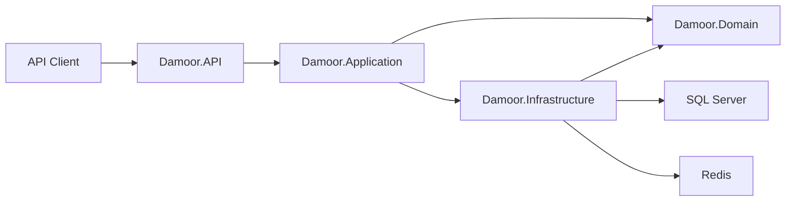

# Damoor

Damoor is a .NET 9 ASP.NET Core Web API for an e-commerce backend. The current implementation focuses on authentication, product catalog browsing, category management, product variant management, product image management, identity roles, SQL Server persistence, and Redis-backed infrastructure services.

## Overview

Damoor provides API endpoints for a storefront-style catalog and administrative catalog maintenance.

| Area | Description |
| --- | --- |
| Business purpose | E-commerce backend for managing and exposing products, categories, product variants, product images, users, carts, wishlists, orders, and reviews. |
| Main functionality | Public category and product catalog queries, user sign-up/sign-in, admin-only category/product/variant/image commands, health checks, API versioning, and Swagger documentation. |
| Target users | API consumers, storefront clients, administrators, and developers maintaining the backend. |
| Key capabilities | JWT authentication, role-based authorization, CQRS-style request handlers, validation pipeline, SQL Server persistence, soft-delete support, Redis distributed cache registration, and standardized API responses. |

## Architecture

The solution uses a Clean Architecture-style project split with vertical feature slices in the Application layer.



| Project | Responsibility |
| --- | --- |
| `Damoor.API` | ASP.NET Core host, controllers, middleware, filters, Swagger, JWT authentication registration, API versioning, rate limiting, and health check endpoint mapping. |
| `Damoor.Application` | MediatR commands/queries/handlers, DTO/result models, validation rules, response models, and pipeline behaviors. |
| `Damoor.Domain` | Domain entities, common base entity types, soft-delete/non-delete markers, and domain enums. |
| `Damoor.Infrastructure` | EF Core `DbContext`, entity configurations, migrations, Identity user/role setup, SQL Server registration, Redis cache service, local file service, and health check registrations. |

### Solution Structure

```text
Damoor/
|-- Damoor.API/
|   |-- Controllers/
|   |-- Extensions/
|   |-- Filters/
|   |-- Middleware/
|   |-- Services/
|   |-- Program.cs
|   `-- appsettings.json
|-- Damoor.Application/
|   |-- Common/
|   `-- Features/
|       |-- Authentication/
|       |-- Categories/
|       `-- Products/
|-- Damoor.Domain/
|   |-- Common/
|   `-- Entities/
|-- Damoor.Infrastructure/
|   |-- Extensions/
|   |-- Identity/
|   |-- Interfaces/
|   |-- Persistence/
|   `-- Services/
|-- Damoor.sln
`-- README.md
```

### Design Patterns and Runtime Flow

| Pattern | Implementation |
| --- | --- |
| Clean Architecture | API, Application, Domain, and Infrastructure are separated into different projects. |
| Vertical Slice Architecture | Application features are grouped by capability, such as `Authentication`, `Categories`, and `Products`. |
| CQRS-style handlers | Commands and queries are represented as MediatR requests with dedicated handlers. |
| Pipeline behaviors | `LoggingBehaviour<TRequest,TResponse>` logs request handling; `ValidationBehaviour<TRequest,TResponse>` runs FluentValidation validators. |
| Repository pattern | Not identified during code analysis. Handlers use `DamoorDbContext` directly. |
| Unit of Work | EF Core `DbContext` is used as the persistence unit of work. |
| Soft delete | `ISoftDeletable` entities are converted from delete operations into soft deletes by `AuditableEntityInterceptor`. |
| Non-deletable entities | Entities implementing `INonDeletable` throw during delete attempts. |

## Technology Stack

| Category | Technology |
| --- | --- |
| Framework | .NET 9, ASP.NET Core Web API |
| Database | SQL Server |
| ORM | Entity Framework Core 9 |
| Authentication | ASP.NET Core Identity, JWT Bearer tokens |
| Authorization | Role-based authorization with `AdminOnly` policy |
| Validation | FluentValidation |
| Mediator/CQRS | MediatR |
| Logging | Built-in `ILogger`; Serilog packages and extension exist but Serilog is commented out in `Program.cs` |
| Testing | Not identified during code analysis |
| Caching | Redis distributed cache registration with `RedisCacheService` |
| Messaging | Not identified during code analysis |
| API Documentation | Swagger/OpenAPI via Swashbuckle |
| Health Checks | ASP.NET Core health checks for EF Core DbContext and Redis |
| File Storage | Local file service writes under `wwwroot/uploads` |

## Features

| Feature | Status in Codebase |
| --- | --- |
| User sign-up | Implemented with ASP.NET Core Identity, default `User` role assignment, validation, duplicate email handling, and JWT generation. |
| User sign-in | Implemented with password verification, lockout-on-failure behavior, role loading, and JWT generation. |
| Role initialization | Implemented at startup for `User` and `Admin` roles. |
| Optional admin seed | Implemented through `AdminSeed` configuration. |
| Public category listing | Implemented at `GET /api/v1/Categories`. |
| Public category details | Implemented at `GET /api/v1/Categories/{id}`. |
| Admin category creation | Implemented at `POST /api/v1/Admin/Categories`. |
| Admin category update | Implemented at `PUT /api/v1/Admin/Categories/{id}`. |
| Admin category delete | Implemented at `DELETE /api/v1/Admin/Categories/{id}`. |
| Public product listing | Implemented at `GET /api/v1/Products` with pagination, filtering, and sorting. |
| Public product details | Implemented at `GET /api/v1/Products/{id}` with images, variants, stock, and review summary fields. |
| Public product variants | Implemented at `GET /api/v1/Products/{id}/variants`. |
| Admin product creation | Implemented at `POST /api/v1/Admin/Products`. |
| Admin product update | Implemented at `PUT /api/v1/Admin/Products/{id}`. |
| Admin product delete | Implemented at `DELETE /api/v1/Admin/Products/{id}`. |
| Admin product image creation | Implemented at `POST /api/v1/Admin/Products/{productId}/images`. |
| Admin product image delete | Implemented at `DELETE /api/v1/Admin/ProductImages/{id}`. |
| Admin set main product image | Implemented at `PUT /api/v1/Admin/ProductImages/{id}/main`. |
| Admin product variant creation | Implemented at `POST /api/v1/Admin/Products/{productId}/variants`. |
| Admin product variant update | Implemented at `PUT /api/v1/Admin/ProductVariants/{id}`. |
| Admin product variant delete | Implemented at `DELETE /api/v1/Admin/ProductVariants/{id}`. |
| API versioning | Implemented with URL segment versioning. Default version is `1.0`. |
| Rate limiting | Implemented globally as available policies; strict policy is applied to sign-up and sign-in. |
| Health check endpoint | Implemented at `GET /health`. |
| Standard API response envelope | Implemented through `ApiResponse<T>`. |
| Exception handling middleware | Implemented for validation, bad request, unauthorized, conflict, not found, and unexpected errors. |
| Idempotency filter | Implemented but not identified as applied to any action during code analysis. |
| Cart, wishlist, order, and review domain entities | Domain and EF mappings exist. API endpoints for these areas were not identified during code analysis. |

## Prerequisites

| Requirement | Version / Notes |
| --- | --- |
| .NET SDK | .NET 9 SDK. The local SDK detected during analysis was `9.0.102`. |
| SQL Server | Required for `ConnectionStrings:DefaultConnection`. |
| Redis | Required by Redis cache registration and Redis health check through `ConnectionStrings:Redis`. |
| EF Core CLI | Required for migration commands, if not already installed. |
| External APIs | Not identified during code analysis. |
| Cloud services | Not identified during code analysis. |

## Configuration

Configuration is read from ASP.NET Core configuration providers, including `appsettings.json`, environment-specific settings, user secrets, and environment variables.

The API validates the following values at startup:

| Key | Required | Purpose |
| --- | --- | --- |
| `ConnectionStrings:DefaultConnection` | Yes | SQL Server connection string for EF Core and Identity. |
| `ConnectionStrings:Redis` | Yes for registered Redis services and health check | Redis connection string. |
| `JwtSettings:SecretKey` | Yes | Symmetric signing key. Must be at least 32 characters. |
| `JwtSettings:Issuer` | Yes | JWT issuer. |
| `JwtSettings:Audience` | Yes | JWT audience. |
| `JwtSettings:ExpiryMinutes` | Yes | Access token lifetime in minutes. |
| `AdminSeed:Enabled` | No | Enables optional admin account seeding. |
| `AdminSeed:FullName` | Required when admin seeding is enabled | Seeded admin full name. |
| `AdminSeed:Email` | Required when admin seeding is enabled | Seeded admin email. |
| `AdminSeed:Password` | Required when admin seeding is enabled | Seeded admin password. |

Example local configuration:

```json
{
  "ConnectionStrings": {
    "DefaultConnection": "Server=localhost;Database=Damoor;Trusted_Connection=True;TrustServerCertificate=True;MultipleActiveResultSets=True;",
    "Redis": "localhost:6379"
  },
  "JwtSettings": {
    "SecretKey": "replace-with-a-secure-secret-key-at-least-32-characters",
    "Issuer": "Damoor",
    "Audience": "DamoorClients",
    "ExpiryMinutes": 60
  },
  "AdminSeed": {
    "Enabled": false,
    "FullName": "",
    "Email": "",
    "Password": ""
  }
}
```

### Secrets Management

`Damoor.API.csproj` defines a `UserSecretsId`, so local secrets can be stored with .NET User Secrets:

```bash
dotnet user-secrets set "ConnectionStrings:DefaultConnection" "Server=localhost;Database=Damoor;Trusted_Connection=True;TrustServerCertificate=True;MultipleActiveResultSets=True;" --project Damoor.API
dotnet user-secrets set "ConnectionStrings:Redis" "localhost:6379" --project Damoor.API
dotnet user-secrets set "JwtSettings:SecretKey" "replace-with-a-secure-secret-key-at-least-32-characters" --project Damoor.API
dotnet user-secrets set "JwtSettings:Issuer" "Damoor" --project Damoor.API
dotnet user-secrets set "JwtSettings:Audience" "DamoorClients" --project Damoor.API
```

Do not commit real production connection strings, passwords, or JWT signing keys.

## Getting Started

### Clone Repository

```bash
git clone <repository-url>
cd Damoor
```

### Restore Packages

```bash
dotnet restore Damoor.sln
```

### Build

```bash
dotnet build Damoor.sln
```

### Run

```bash
dotnet run --project Damoor.API
```

The development launch profile is defined in `Damoor.API/Properties/launchSettings.json`.

## Database Setup

The project uses Entity Framework Core with SQL Server. The `DamoorDbContext` lives in `Damoor.Infrastructure/Persistence`, and the migrations assembly is `Damoor.Infrastructure`.

An initial migration exists:

```text
Damoor.Infrastructure/Persistence/Migrations/20260619123031_InitialCreate.cs
```

Apply migrations:

```bash
dotnet ef database update --project Damoor.Infrastructure --startup-project Damoor.API
```

Create a new migration:

```bash
dotnet ef migrations add <MigrationName> --project Damoor.Infrastructure --startup-project Damoor.API --output-dir Persistence/Migrations
```

### Seed Data

At application startup, the identity initializer ensures the `User` and `Admin` roles exist.

Optional admin seeding is controlled by:

```json
{
  "AdminSeed": {
    "Enabled": true,
    "FullName": "Admin User",
    "Email": "admin@example.com",
    "Password": "ChangeMe1"
  }
}
```

No general product/category seed data was identified during code analysis.

## API Documentation

Swagger/OpenAPI is configured and enabled only in the Development environment.

After running the API in Development, open:

```text
/swagger
```

Swagger includes a Bearer token security definition. Use this format:

```text
Bearer <access-token>
```

### Important Endpoints

| Method | Endpoint | Auth | Description |
| --- | --- | --- | --- |
| `POST` | `/api/v1/Auth/sign-up` | Anonymous | Create a user account and return a JWT. |
| `POST` | `/api/v1/Auth/sign-in` | Anonymous | Authenticate a user and return a JWT. |
| `GET` | `/api/v1/Categories` | Anonymous | List categories. |
| `GET` | `/api/v1/Categories/{id}` | Anonymous | Get category details. |
| `GET` | `/api/v1/Products` | Anonymous | List products with pagination, filtering, and sorting. |
| `GET` | `/api/v1/Products/{id}` | Anonymous | Get product details. |
| `GET` | `/api/v1/Products/{id}/variants` | Anonymous | List variants for a product. |
| `POST` | `/api/v1/Admin/Categories` | Admin | Create category. |
| `PUT` | `/api/v1/Admin/Categories/{id}` | Admin | Update category. |
| `DELETE` | `/api/v1/Admin/Categories/{id}` | Admin | Delete category. |
| `POST` | `/api/v1/Admin/Products` | Admin | Create product. |
| `PUT` | `/api/v1/Admin/Products/{id}` | Admin | Update product. |
| `DELETE` | `/api/v1/Admin/Products/{id}` | Admin | Delete product. |
| `POST` | `/api/v1/Admin/Products/{productId}/images` | Admin | Add product image by URL. |
| `POST` | `/api/v1/Admin/Products/{productId}/variants` | Admin | Add product variant. |
| `DELETE` | `/api/v1/Admin/ProductImages/{id}` | Admin | Delete product image. |
| `PUT` | `/api/v1/Admin/ProductImages/{id}/main` | Admin | Set image as main product image. |
| `PUT` | `/api/v1/Admin/ProductVariants/{id}` | Admin | Update product variant. |
| `DELETE` | `/api/v1/Admin/ProductVariants/{id}` | Admin | Delete product variant. |
| `GET` | `/health` | Not explicitly protected | Return application health check status. |

### Product Query Parameters

`GET /api/v1/Products` accepts:

| Parameter | Description |
| --- | --- |
| `Page` | Page number. Must be at least `1`. Default is `1`. |
| `PageSize` | Page size. Must be between `1` and `100`. Default is `10`. |
| `Search` | Searches product name and description. Maximum length is `100`. |
| `CategoryId` | Filters by category. |
| `MinPrice` | Minimum variant price. |
| `MaxPrice` | Maximum variant price. |
| `Size` | Variant size filter. Maximum length is `32`. |
| `Color` | Variant color filter. Maximum length is `64`. |
| `InStock` | Filters variants with stock greater than zero when `true`; stock equal to zero when `false`. |
| `SortBy` | Allowed values: `name`, `price`, `createdat`. |
| `Asc` | Sort direction. Default is `true`. |

## Authentication & Authorization

Authentication uses ASP.NET Core Identity and JWT Bearer tokens.

| Concern | Implementation |
| --- | --- |
| User store | ASP.NET Core Identity backed by EF Core and SQL Server. |
| User entity | `AppUser : IdentityUser<int>` with `FullName`, audit fields, soft-delete fields, and navigation properties. |
| Token generation | `JwtAccessTokenService` creates HMAC-SHA256 signed JWTs. |
| Claims | Subject, email, name, JWT ID, and one `role` claim per assigned role. |
| Roles | `User`, `Admin`. |
| Policies | `AdminOnly`, requiring the `Admin` role. |
| Protected endpoints | Admin controllers under `/api/v1/Admin/...`. |
| Anonymous endpoints | Auth, public Categories, and public Products controllers. |
| Password rules | Require digit, uppercase letter, minimum length of 5, and no non-alphanumeric requirement. |
| Lockout | Maximum 5 failed access attempts; default lockout duration is 15 minutes. |

## Project Structure

### `Damoor.API`

| Folder/File | Purpose |
| --- | --- |
| `Program.cs` | Application startup, service registration, middleware pipeline, Swagger, rate limiting, authentication, authorization, static files, controllers, and health checks. |
| `Controllers/` | API controllers and partial controller action files. |
| `Controllers/Admin/` | Admin-only product, category, image, and variant commands. |
| `Extensions/` | Startup extensions for authentication, Swagger, API versioning, rate limiting, logging, and configuration validation. |
| `Filters/` | Swagger operation filter and idempotency filter. |
| `Middleware/ExceptionHandlingMiddleware.cs` | Converts known exceptions to standard API error responses. |
| `Services/JwtAccessTokenService.cs` | Generates JWT access tokens. |

### `Damoor.Application`

| Folder/File | Purpose |
| --- | --- |
| `DependencyInjection.cs` | Registers MediatR, FluentValidation validators, logging behavior, and validation behavior. |
| `Common/Behaviours/` | MediatR pipeline behaviors. |
| `Common/Exceptions/` | Application exception types mapped by middleware. |
| `Common/Models/` | `ApiResponse<T>`, pagination metadata, and paginated list model. |
| `Features/Authentication/` | Sign-up/sign-in commands, handlers, validators, and auth response models. |
| `Features/Categories/` | Category commands and queries. |
| `Features/Products/` | Product commands, queries, result DTOs, image models, and variant models. |

### `Damoor.Domain`

| Folder/File | Purpose |
| --- | --- |
| `Common/BaseEntity.cs` | Shared integer ID and audit timestamps. |
| `Common/SoftDeletableEntity.cs` | Base class for soft-deletable entities. |
| `Common/ISoftDeletable.cs` | Soft-delete contract. |
| `Common/INonDeletable.cs` | Marker for entities that should not be deleted. |
| `Entities/` | Domain entities for categories, products, variants, images, sessions, carts, wishlists, orders, order items, and reviews. |
| `Entities/Enums/OrderStatus.cs` | Order lifecycle enum. |

### `Damoor.Infrastructure`

| Folder/File | Purpose |
| --- | --- |
| `DependencyInjection.cs` | Registers database, identity, caching, file service, and health checks. |
| `Extensions/DatabaseExtensions.cs` | Registers SQL Server `DamoorDbContext` with retry and command timeout settings. |
| `Extensions/IdentityExtensions.cs` | Registers ASP.NET Core Identity. |
| `Extensions/CachingExtensions.cs` | Registers StackExchange Redis distributed cache and `ICacheService`. |
| `Identity/` | Identity user, auth constants, JWT/admin seed settings, and role/admin initializer. |
| `Interfaces/` | `ICacheService` and `IFileService`. |
| `Persistence/DamoorDbContext.cs` | EF Core DbContext and DbSets. |
| `Persistence/Configurations/` | EF Core table, key, relationship, index, constraint, precision, and query filter mappings. |
| `Persistence/Interceptors/AuditableEntityInterceptor.cs` | Applies audit timestamps, soft-delete behavior, and non-delete protection. |
| `Persistence/Migrations/` | EF Core migrations. |
| `Services/LocalFileService.cs` | Stores uploaded file streams under `wwwroot/uploads`. |
| `Services/RedisCacheService.cs` | JSON-based distributed cache wrapper. |

## Domain Model Summary

| Entity | Purpose |
| --- | --- |
| `Category` | Product grouping with name and optional description. Soft-deletable. |
| `Product` | Catalog item with category, variants, images, wishlist items, and reviews. Soft-deletable. |
| `ProductVariant` | SKU, size, color, price, stock quantity. Soft-deletable. |
| `ProductImage` | Product image URL and main image marker. |
| `ShoppingSession` | Session token, optional user, expiration, and cart relationship. |
| `Cart` | One cart per shopping session. |
| `CartItem` | Cart line item tied to a product variant. |
| `Wishlist` | User wishlist. |
| `WishlistItem` | Wishlist product entry. |
| `Order` | User or guest order with total, status, shipping address, and line items. Non-deletable. |
| `OrderItem` | Order line snapshot with product name, variant description, quantity, and unit price. Non-deletable. |
| `Review` | Product review with rating and optional comment. Soft-deletable. |
| `AppUser` | Identity user with full name, audit fields, soft-delete fields, and navigation properties. |

## Logging & Monitoring

| Concern | Implementation |
| --- | --- |
| Request logging | MediatR `LoggingBehaviour` logs request name, payload, and elapsed time. |
| Exception logging | `ExceptionHandlingMiddleware` logs validation warnings and unhandled exceptions. |
| Serilog | `Serilog.AspNetCore` and `Serilog.Sinks.MSSqlServer` are referenced, and `LoggingExtensions.AddSerilog` exists. Serilog registration and request logging are commented out in `Program.cs`. |
| Health checks | `/health` checks EF Core DbContext and Redis. |
| Monitoring integrations | Not identified during code analysis. |
| Log locations | Console and SQL Server sink are configured in the Serilog extension, but inactive unless Serilog is enabled in startup. |

## Testing

No test projects were identified in the solution during code analysis.

If tests are added later, run them with:

```bash
dotnet test Damoor.sln
```

Recommended test coverage based on current implementation:

| Test Type | Recommended Coverage |
| --- | --- |
| Unit tests | Validators, handlers, token service, pagination/filtering/sorting logic, duplicate checks, soft-delete behavior. |
| Integration tests | Auth flow, admin authorization, public catalog endpoints, database mappings, exception middleware responses, health checks. |
| Regression tests | Product query filters, role initialization, admin seed behavior, unique category/product variant constraints, main image uniqueness. |

## Deployment

Docker support was not identified during code analysis. Kubernetes support was not identified during code analysis.

For non-container deployment:

1. Provide production values for SQL Server, Redis, JWT settings, and optional admin seed through the deployment environment secret store.
2. Apply EF Core migrations to the target database.
3. Run the `Damoor.API` project or published API artifact.
4. Ensure the API can reach SQL Server and Redis.
5. Ensure file system permissions allow writes to `wwwroot/uploads` if `LocalFileService` is used.

Publish example:

```bash
dotnet publish Damoor.API -c Release -o ./publish
```

Run published output:

```bash
dotnet ./publish/Damoor.API.dll
```

## CI/CD

CI/CD configuration was not identified during code analysis.

No GitHub Actions, Azure DevOps, GitLab CI, Jenkins, Dockerfile, Docker Compose file, or Kubernetes manifests were found in the analyzed repository files.

## Dependencies

| Dependency | Project | Purpose |
| --- | --- | --- |
| `Asp.Versioning.Http` | `Damoor.API` | API versioning support. |
| `Asp.Versioning.Mvc.ApiExplorer` | `Damoor.API` | API version explorer integration for Swagger. |
| `AspNetCore.HealthChecks.UI.Client` | `Damoor.API` | Health check response writer. |
| `Microsoft.AspNetCore.Authentication.JwtBearer` | `Damoor.API` | JWT bearer authentication. |
| `Microsoft.AspNetCore.OpenApi` | `Damoor.API` | OpenAPI support. |
| `Swashbuckle.AspNetCore` | `Damoor.API` | Swagger generation and UI. |
| `Serilog.AspNetCore` | `Damoor.API`, `Damoor.Infrastructure` | Serilog integration package. |
| `FluentValidation` | `Damoor.Application` | Request validation. |
| `FluentValidation.DependencyInjectionExtensions` | `Damoor.Application` | Validator registration. |
| `MediatR` | `Damoor.Application` | Mediator request/handler pattern. |
| `Microsoft.AspNetCore.Identity.EntityFrameworkCore` | `Damoor.Infrastructure` | Identity persistence over EF Core. |
| `Microsoft.EntityFrameworkCore.SqlServer` | `Damoor.Infrastructure` | SQL Server provider. |
| `Microsoft.EntityFrameworkCore.Tools` | `Damoor.Infrastructure` | EF Core migration tooling. |
| `Microsoft.EntityFrameworkCore.Design` | `Damoor.API` | EF Core design-time services. |
| `Microsoft.Extensions.Caching.StackExchangeRedis` | `Damoor.Infrastructure` | Redis distributed cache. |
| `AspNetCore.HealthChecks.Redis` | `Damoor.Infrastructure` | Redis health check. |
| `Microsoft.Extensions.Diagnostics.HealthChecks.EntityFrameworkCore` | `Damoor.Infrastructure` | EF Core health check. |
| `Serilog.Sinks.MSSqlServer` | `Damoor.Infrastructure` | SQL Server sink for Serilog. |

## Troubleshooting

| Issue | Cause | Resolution |
| --- | --- | --- |
| Application fails at startup with missing `ConnectionStrings:DefaultConnection` | Required SQL Server connection string is not configured. | Configure it in user secrets, environment variables, or deployment secrets. |
| Application fails at startup with missing or short `JwtSettings:SecretKey` | JWT secret is required and must be at least 32 characters. | Configure a secure secret key of at least 32 characters. |
| `/health` reports Redis failure | Redis is not running or `ConnectionStrings:Redis` is incorrect. | Start Redis or correct the Redis connection string. |
| Admin endpoints return `401` | Request is missing a valid bearer token. | Sign in and send `Authorization: Bearer <token>`. |
| Admin endpoints return `403` | Authenticated user does not have the `Admin` role. | Assign the user to `Admin` or enable valid admin seeding. |
| Duplicate category name fails | Category name has a unique filtered index and handler duplicate check. | Use a unique category name. |
| Duplicate SKU or size/color variant fails | Product variant configuration and handlers enforce uniqueness. | Use a unique SKU and unique size/color per product. |
| Product list sorting validation fails | `SortBy` only accepts `name`, `price`, or `createdat`. | Use one of the supported sort fields. |
| Product list page size validation fails | `PageSize` must be between 1 and 100. | Use a supported page size. |
| File uploads are not appearing through current API endpoints | `LocalFileService` exists, but current product image API accepts an image URL rather than multipart upload. | Store/upload the file separately or add an upload endpoint. |

## Contributing

Development should follow the existing code organization and patterns:

| Guideline | Existing Pattern |
| --- | --- |
| Add API behavior through controllers | Controllers are partial classes grouped by feature/action files. |
| Add business operations through MediatR | Commands and queries live under `Damoor.Application/Features/<Feature>/...`. |
| Validate requests with FluentValidation | Each command/query with validation uses a validator in the same feature folder. |
| Return consistent API responses | Use `ApiResponse<T>` helpers from `ApiBaseController`. |
| Use EF Core mappings | Add or update configuration classes under `Damoor.Infrastructure/Persistence/Configurations`. |
| Preserve soft-delete behavior | Use `SoftDeletableEntity` and the audit interceptor when deletion should be logical. |
| Protect admin capabilities | Use `AdminOnly` policy through admin controllers or authorization attributes. |
| Keep secrets out of source control | Use user secrets or deployment secret stores for connection strings and JWT keys. |

## License

Not identified during code analysis.
